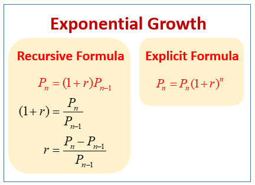
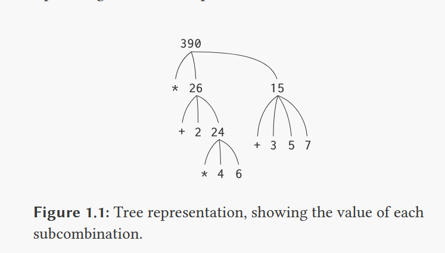

# Ideia geral 
- Conforme encontrado no site, será escrito as informacoes até o capítulo 3, sendo separado em tópicos !

# Building Abstractions with Procedures
# Ideia de um processo computacional 1.0
### Dados (data)
- Processo de manipular coisas abstratas chamadas de dados
### Programa (program)
- Padrao de regras / direcionamentos para direcionar processos 
## Linguagem de programacao
- Expressoes simbolicas que vao descrever as tarefas que precisam ser executadas

## Programming in Lisp
- Linguagem natural que utilizava de expressoes logicas com as equacoes recursivas
### recursion equation
- Uma equacao que define o proximo termo, baseado no termo anterior !


### Lisp Interpreter
- Uma maquina que carregava os processos descritos na linguagem LISP
### procedures (procedimentos / metodos)
- Sao metodos / blocos de codigo que realizam aluma funcao

# 1.1 The Elements of Programming
## 3 Mecanismos que linguagens boas tem !
### Expressoes Primitivas
- Que representa as entidades mais simples que a linguagem se preocupa
- Examples: values, objects, functions, classes
### Meios de combinacao
- Elementos complexos sao construidos de elementos mais simples
### Meios de abstracao
- Elementos compostos odem ser nomeados e manipulados como unidades 

## Procedures and data
- Data é aquilo que queremos manipular e procedures sao as descricoes das regras para manipulacao do dado
- Toda linguagem de programacao boa deve possibilitar descrever os tipos de dados basicos (numero, boolean, simbolos) e metodos primitivos (soma, divisao, listas)

# 1.1.1 Expressoes
- Uma expressao primitiva mais comum sao os proprios numereos
- Podem ser representados combinando um procedimentos / funcoes primitivas, como a soma de um numero
## Combinacoes 
- Sao feitas com base no que esta em parenteses
```
// Exemplo em Lisp
(+ 2.7 10) // Combinacao
```
- Operador é aquele que tem funcionalidade (+)
- "Operandos" ; Operands sao os elementos que sofrem a funcionalidade
- Argumento é o valor imbutido dos operandos !
## Prefix Notation
- É o fato do operador vir na esquerda
- Sua vantagem é ser possível adicionar diversos métodos ao mesmo tempo
```
(+ (* 3 5) (- 10 6))
19
```

```
(+ (* 3 5) (- 10 6))
19

(+ (* 3
      (+ (* 2 4)
         (+ 3 5)))
   (+ (- 10 7)
      6))
```
1.1.2 Naming and the Environment
- O nome identifica uma variável
- O valor dessa variável é o objeto
```
(define pi 3.14159)
(define radius 10)


(* pi (* radius radius))
314.159

(define circumference (* 2 pi radius))

circumference
62.8318
```
## environment 
- Essa memória que guarda o valor é o ambiente, sendo nesse caso o ambiente global, havendo outras

1.1.3 Evaluating Combinations
```
(* (+ 2 (* 4 6)) (+ 3 5 7))
```
- Na expressao acima, cada resultado representa um nó e cada ramificacao um operador e um operando 
- Observar de baixo para cima




# 1.1.4 Compound Procedures (procedimento composto)
- Numeros e operadoes aritimeticos sao dados e procedimentos primitivos
- Aninhar combinacoes (parenteses) permite combinar operacoes
- Definicoes (nomear variaveis) com valores, permite abstracoes

## procedure definitions
- Uma operacao comosta que ode ter um nome e ser referida como unidade
```
(define (square x) (* x x))

We can understand this in the following way:

(define (square x)    (*       x       x))
  |      |      |      |       |       |
 To square something, multiply it by itself.

The general form of a procedure definition is

(define (⟨name⟩ ⟨formal parameters⟩) ⟨body⟩)
```
### Name
- Simbolo associado com o ambiente
### Formal parameters
- Nomes sudados em conjunto com o coro ara referenciar com os arumentos correspondentes do procedimento
### Body
- A exressao que os valores do campo vao ser substituidos elos argumentos atuais conforme o procedimento
### Name
- o nome e os parametros formais sao agrupados em parenteses conforme definido na expressao
```
(square 21)
441

(square (+ 2 5))
49

(square (square 3))
81
```
#### Outros exemplos
- Pode ser utilizado como um bloco que define outros procedimentos 
```
For example, x 2 + y 2 can be expressed as

(+ (square x) (square y))


(define (sum-of-squares x y)
  (+ (square x) (square y)))

(sum-of-squares 3 4)
25


(define (f a)
  (sum-of-squares (+ a 1) (* a 2)))

(f 5)
136
```
